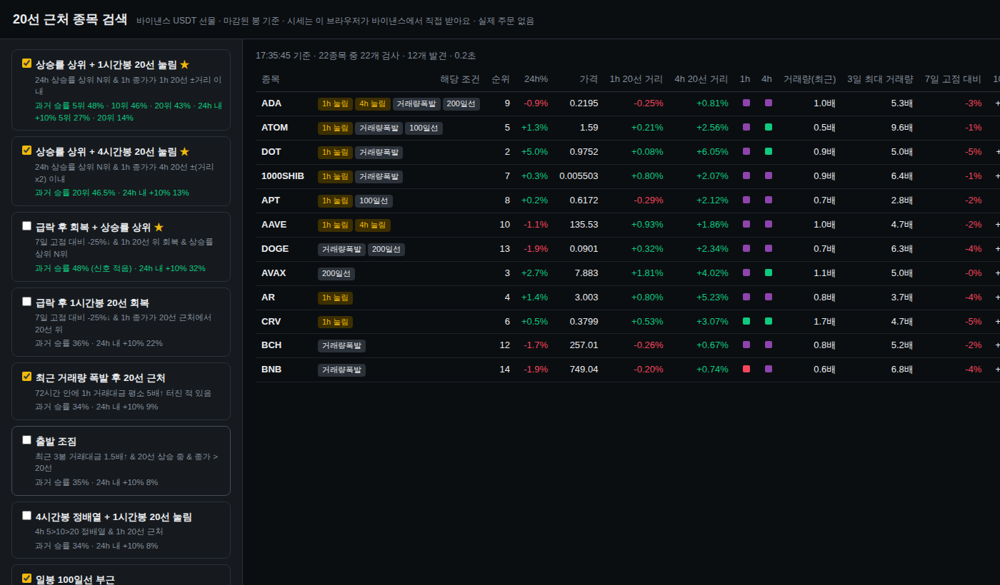
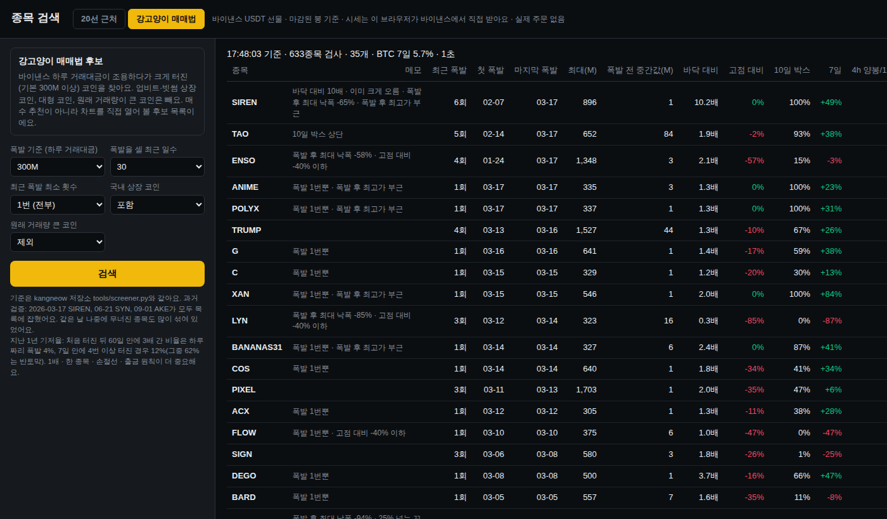

# ma20-screener

바이낸스 USDT-M 선물에서 **20선 근처 종목**(1시간봉·4시간봉)과 **일봉 100·200일선 부근 종목**을 찾는 검색 페이지입니다.

- 주소: https://ta6546.github.io/ma20-screener/
- 시세는 페이지를 연 브라우저가 바이낸스 공개 API(`fapi.binance.com`)에서 직접 받아요. 서버·API 키·실제 주문 없음.
- 조건별 과거 승률은 알트 200종 백테스트 값입니다 (1시간봉 조건 2024-01~2026-09, 일봉 조건 2021-01~2026-09). **2026-10-08 수정:** 이전에 ★로 표시했던 '상승률 상위' 조건은 순위 계산에 1시간 미래 값이 섞인 오류가 있었어요. 고친 결과 어떤 조건도 본전 승률(37.5%)을 넘지 못했어요. 후보 찾기 용도로만 쓰세요.
- 미국 IP나 일부 VPN에서는 바이낸스가 막혀서 작동하지 않아요.

**강고양이 매매법 탭**: kangneow 저장소 `tools/screener.py`와 같은 기준(하루 거래대금 300M 이상 폭발, 국내 상장·대형·원래 거래량 큰 코인 제외). 같은 데이터로 파이썬 결과와 35개 종목·순서·메모까지 일치 확인. 주소 끝에 `#kg`를 붙이면 이 탭으로 바로 열려요.

